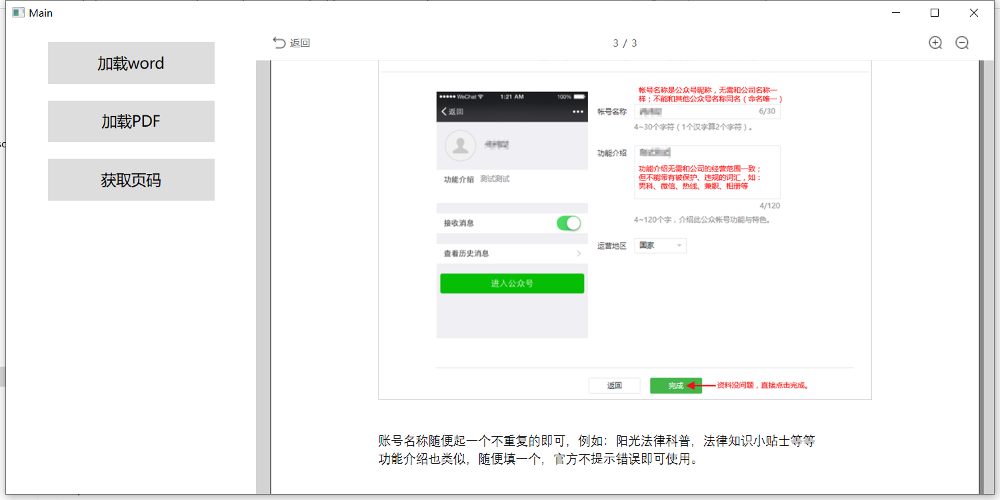

# PDFWordPreview

#### 介绍
PDF和Word预览，可用于WPF和Winform。
原理是采用spire把word或者pdf文件转成xps文件，用documentViewer来呈现，并重新封装了显示的样子

#### 软件架构
WPF
需要引用的包，本地程序集
ReachFramework
spire.office
Microsoft.Office.Interop.Word.dll

#### 使用方法
spire把word或者pdf文件转成xps文件
word转化提供另外一种方法，采用引用Microsoft.Office.Interop.Word.dll